# Репозиторий для выкладки лекций и домашних заданий.

## Описание папок
`unit_one` - папка содержит задачи по первому модулю  
`lesson__1__06.04.2022` - папка на день проведения занятия  
`classwork` - задачи для выполнения в классе  
`homework` - задачи для выполнения дома 
`task1.py` - задача на каждый урок нумеруется в диапазоне от 1 до infinity  
`manual` - папка с опорным материалом 

### Пример папки преподавателя:
```
  unit_one
     -- lesson__1__14.09.2022 
             -- classwork
                  -- task1.py
                  -- task2.py
             -- homework
                  -- task1.py
                  -- task2.py
             -- manual  
                  -- file.md
                  -- file.pdf
                  -- file.py
  unit_two
     -- 10_lesson__10__07.10.2022
     ...
```




```mermaid
graph TD;
    unit_one-->1_lesson_06.04.2022;
    1_lesson_06.04.2022-->classwork;
    classwork-->task1.py;
    classwork-->task2.py;
    1_lesson_06.04.2022-->homework;
    homework-->task2.py;
    homework-->task3.py;
    1_lesson_06.04.2022-->manual;
    manual-->file.md;
    manual-->file.pdf
    manual-->file.py       
```

### Пример папки слушателя:
`python_autumn_2022_task` - название репозитария слушателя   
`unit_one` - папка содержит задание по модулю. Наименование файлов не
меняется.

```
    unit_one
        -- task1.py
        -- task2.py
        -- task3.py
    unit_two
        -- task4.py
        -- task5.py
``` 


